# Machine Problem 1

_By:_ \
_Diez, Reca Jane_ \
_Gonzales, Kyle Angelo_ \
_Pulvera, Eusib Vincent_

---

### Compiling the Code

In our initial attempt to perform the machine problem on a Windows machine, we encountered an error related to a missing compilation flag. It became apparent that a Linux environment was necessary for successful execution. We transitioned to WSL Ubuntu for compatibility and convenience.

During compilation, we ran into the following error.

```
fatal error: bits/libc-header-start.h: No such file or directory
27 | #include <bits/libc-header-start.h>
| ^~~~~~~~~~~~~~~~~~~~~~~~~~
compilation terminated.
```

This issue arose because on 64-bit platforms, gcc typically includes 64-bit libraries. Recognizing the need for a 32-bit architecture, we installed the necessary 32-bit libraries and successfully resolved the problem and compiled `vuln.c` on our Linux setup.

### Inspecting the Registers

After compiling the code, we wanted to observe how the registers and stack changes throughout the execution of the program. This helped us reaacquaint ourselves with the stack and CPU regiseters during x86 function execution.

1. From our lecture, we learned that before `$eip` jumps to `vuln()`'s instructions, the next instruction of `main()` is pushed to the stack - the `rip`. We were able to verify this:

   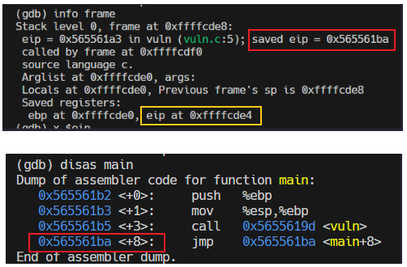

   The `rip` (`0x565561ba`) is stored in the stack at the address `0xffffcde4`

2. `$ebp` is pushed to the stack at position `0xffffcde0`, storing the base of the previous stack frame - the `sfp`.

   ```sh
   0x5655619d <+0>:     push   %ebp
   ```

   Since the `sfp` was pushed after the `rip`, the `sfp` must be 4 bytes below the address storing the `rip` (`0xffffcde4`). We were able to verify this:

   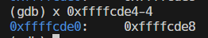
   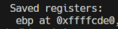

3. `$ebp` is moved to the position of `$esp`, representing the start of a new stack frame.

   ```sh
   0x5655619e <+1>:     mov    %esp,%ebp
   ```

   This also means that ebp is pointing to the address that holds the sfp, as shown below:

   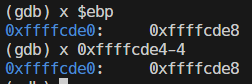

4. Now, for the actual C code. We allocate 8 bytes for the `buffer` by decrementing `$esp`. This means that the stack pointer (and the address of the `buffer`) should be 8 bytes below `$ebp`, `0xffffcdd8`, as shown below:

   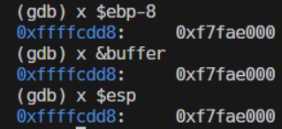

This is all the reconnaissance that is needed before we start our stack smashing. We were able to identify the positions of the base pointer `$ebp` and the return instruction `rip`, relative to the address of the `buffer`.

To summarize, here is a visualization of our current state of stack after allocation memory of the buffer:

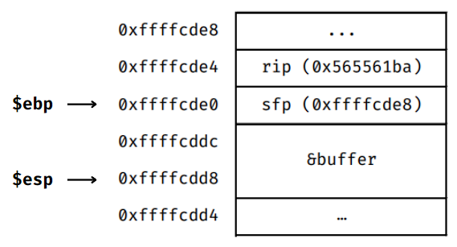

### Preparing for the Stack Smashing Attack

Our objective for the stack smashing attack is to overload the `buffer` and `sfp` with malicious shellcode and overwrite the `rip` with the address of the `buffer`. This manipulation ensures that, upon completion of `vuln()`, the program executes our malicious code instead of returning to `main()`.

From our reconnaissance, we learned that the `rip` is 4 bytes above the `$ebp` and the `buffer` is 8 bytes below the `ebp`. Thus, the length of the **shellcode** can be calculated by:

```sh
(gdb) p $ebp+4-&buffer[0]
12
```

Thus, the first 12 bytes of our payload will be allocated for the shellcode. This will overload the `buffer` and `sfp`. The next 4 bytes will contain the address to our malicious shellcode injected in the `buffer`. **The total length of our payload is 16 bytes**.

Before we attempted to inject actual shellcode, we wanted to test if we were moving in the right direction by simply overloading the buffer with a 16-byte-long string of characters.

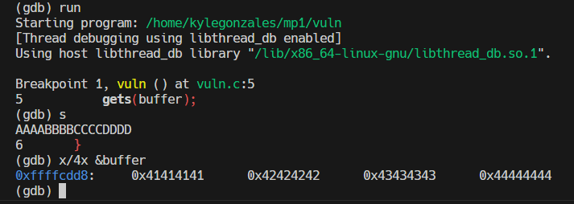

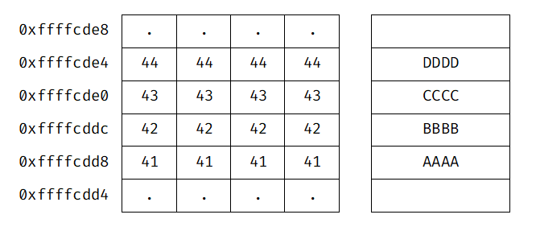

It worked!

### Building the Payload

The objective of our shell code is to terminate the program with an exit code of `1`. After some Google searching, we learned that we can do this with a system call. A **system call** interrupts the current process and switches to kernel mode in order to perform OS processes.

The assembly code below will carry out our objective:

```c
void main() {
    __asm__(
        "xor %eax,%eax;"
        "inc %eax;"
        "mov %ebx,%eax;"
        "int 0x80;"
    );
}
```

Let's go over it line by line:

1. `xor %eax,%eax;` - sets the `$eax` register to 0, which essentially clears the register. Each system call is represented by a number, which is stored in this general purpose register.
2. `inc %eax;` - increments `$eax` from 0 to 1. System call 1 represents the **exit** system call - `sys_exit`.
3. `mov %ebx,%eax;` - sets the value of `%ebx` to 1. `sys_exit` takes an additional integer argument, which is stored in the general purpose register `%ebx`. We set `%ebx` to 1 because our objective is to have an exit code of 1.
4. `int 0x80;` - causes an interrupt and calls the kernel to carry out the system call.

The assembly code is compiled and the machine code is extracted:

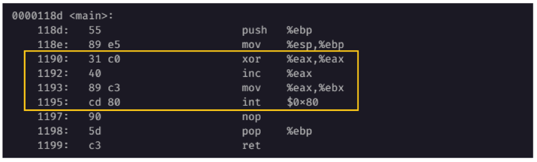

The first section of our payload is the shellcode is:

```
\x31\xc0\x40\x89\xc3\xcd\x80
```

Remember that the shellcode section of our payload must be 12 bytes in order to be able to smash the `rip`. Since our shellcode is only 7 bytes long, we will pad it with 5 characters:

```
\x31\xc0\x40\x89\xc3\xcd\x80EUSIB
```

Finally, we will complete the payload by appending the address to our shellcode. In this case, it is the address of `buffer`, `0xffffcdd8`.

```
\x31\xc0\x40\x89\xc3\xcd\x80EUSIB\xd8\xcd\xff\xff
```

_NOTE: We remember to append the address starting from the least significant byte, following the little-endian system, as per the default configurations of gcc._

Payload complete. Let's smash.

### Attacking the Vulnerable Program

We wrote the shellcode into a file called `egg`. Then, we ran `vuln` in gdb, passing in the contents of `egg` as the input.

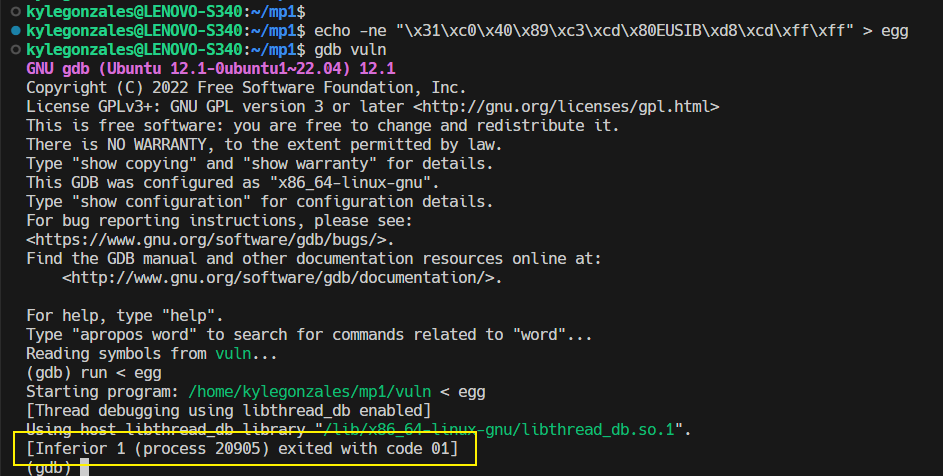

The program was successfully terminated with an exit code of 1.

### Reviewing the Attack

We stepped through the execution of the program to view the registers after the buffer overload.

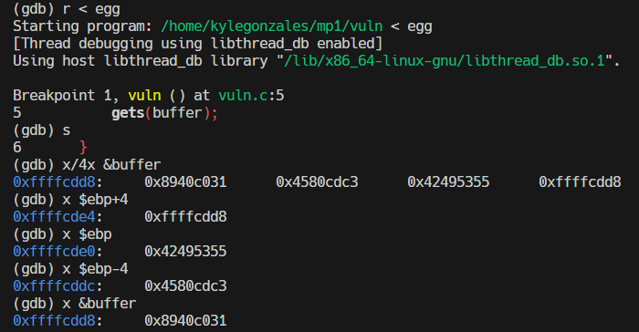

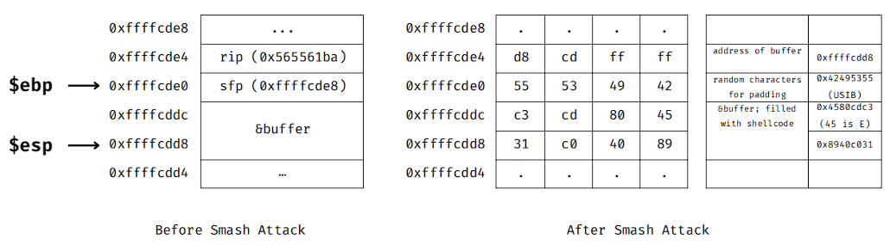

### Conclusion
